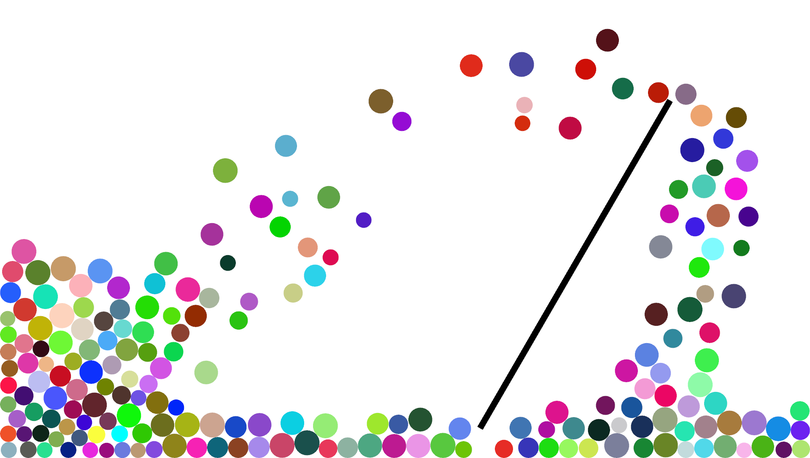

# sfml-dynamics

A 2D rigid-body dynamics engine in C++, with graphics implemented using SFML. Currently includes bouncing balls, and walls that can move & rotate. A visual studio solution is provided, but the code should also compile on Linux & macOS since SFML is a cross-platform library.

## Implementation details

To determine the outcome of a collision, the program first uses the geometry of the colliding objects to find the collision normal and tangent vectors, then resolves the velocities of the objects along these directions. The new normal components of the velocities are set according to conservation of momentum, with energy losses parametrised by a coefficient of restitution e. Next, the new tangential components are set according to F ≤ μR, where μ is a coefficient of friction, R is the normal impulse that was applied, and F is the corresponding frictional impulse. See [Ball.cpp](sfml-dynamics/Ball.cpp) for the implementation of this procedure.
